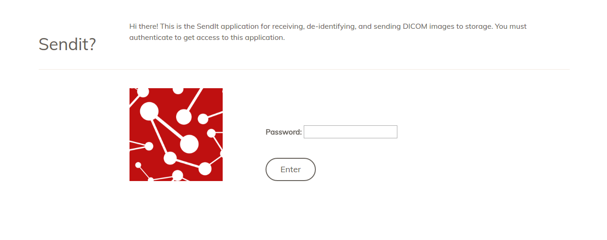

# Configuration
The configuration for the application consists of the files in the [sendit/settings](../sendit/settings) folder. The files that need attention are `secrets.py` and [config.py](../sendit/settings/config.py).  

## Application Secrets
First make your secrets.py like this:

```
cp sendit/settings/bogus_secrets.py sendit/settings/secrets.py
vim sendit/settings/secrets.py
```

Once you have your `secrets.py`, it needs the following added:

 - `SECRET_KEY`: Django will not run without one! You can generate one [here](http://www.miniwebtool.com/django-secret-key-generator/)
 - `DEBUG`: Make sure to set this to `False` for production.

## "De-identification" (Coding)
For [config.py](../sendit/settings/config.py) you should first configure settings for the deidentification process, which is everything that happens after images are import, but before sending to storage. These steps broadly include:

 - extraction of header data from the image
 - preparation of data to send to the DASHER REST API
 - checking and scrubbing of pixel data

and coincide with the following variables in [config.py](../sendit/settings/config.py):

```
# If True, we will have the images first go to a task to retrieve fields to deidentify
DEIDENTIFY_RESTFUL=True
```

If `DEIDENTIFY_RESTFUL` is False, we skip this task, and the batch is sent to the next task (or tasks) to send to different storage. You should **not** do this without careful thought because you **cannot** send identified data to Google Cloud.  If `DEIDENTIFY_RESTFUL` is True, the batch is first put in the queue to be de-identified, and then upon receival of the identifiers, the batch is put into the queue to be sent to storage.

```
# If True, scrub pixel data for images identified by header "Burned in Annotation" = "NO"
DEIDENTIFY_PIXELS=False
```

**Important** the pixel scrubbing is not yet implemented, so this variable will currently only check for the header, and alert you of the image, and skip it. Regardless of the setting that you choose for the variable `DEIDENTIFY_PIXELS` the header will always be checked. If you have pixel scrubbing turned on (and it's implemented) the images will be scrubbed, and included. If you have scrubbing turned on (and it's not implemented) it will just yell at you and skip them. The same thing will happen if it's off, just to alert you that they exist.

```
# The default study to use
SOM_STUDY="test"
```
The `SOM_STUDY` is part of the Stanford DASHER API to specify a study, and the default should be set before you start the application. If the study needs to vary between calls, please [post an issue](https://www.github.com/pydicom/sendit) and it can be added to be done at runtime. 

```
# PatientID and SOPInstanceUID:
# These are default for deid, but we can change that here
ENTITY_ID="PatientID"
ITEM_ID="SOPInstanceUID"
```

Note that the fields for `ENTITY_ID` and `ITEM_ID` are set to the default of [deid](https://pydicom.github.io/deid), but I've added them here in case it ever needs to be changed.  For all functions provided by `deid`, remember that they can be modified to use different endpoints, or do different replacements in the data. For more details about the deidentify functions, see [docs/deidentify.md](deidentify.md)


## Storage
The next set of variables are specific to [storage](storage.md), which is the final step in the pipeline.

```
# We can turn on/off send to Orthanc. If turned off, the images would just be processed
SEND_TO_ORTHANC=True

# The ipaddress of the Orthanc server to send the finished dicoms (cloud PACS)
ORTHANC_IPADDRESS="127.0.0.1"

# The port of the same machine (by default they map it to 4747
ORTHAC_PORT=4747
```

Since the Orthanc is a server itself, if we are ever in need of a way to quickly deploy and bring down these intances as needed, we could do that too, and the application would retrieve the ipaddress programatically.

And I would (like) to eventually add the following, meaning that we also send datasets to Google Cloud Storage and Datastore, ideally in compressed nifti instead of dicom, and with some subset of fields. These functions are by default turned off.

```
# Should we send to Google at all?
SEND_TO_GOOGLE=False

# Google Cloud Storage Bucket (must be created)
GOOGLE_CLOUD_STORAGE='radiology'
GOOGLE_STORAGE_COLLECTION=None # define here or in your secrets
```

Note that the storage collection is set to None, and this should be the id of the study (eg, the IRB). If this is set to None, it will not upload. Also note that this approach isn't suited for having more than one study - when that is the case, the study will likely be registered with the batch. Importantly, for the above, there must be a `GOOGLE_APPLICATION_CREDENTIALS` filepath exported in the environment, or it should be run on a Google Cloud Instance (unlikely).


## Authentication
If you look in [sendit/settings/auth.py](../sendit/settings/auth.py) you will see something called `lockdown` and that it is turned on:

### Dasher
Dasher requires a token and refresh token (see [Stanford Open Modules](https://vsoch.github.io/som/identifiers.html) for details) and you need to put the path to that file in the base folder, which is mapped to the image. This is also a setting in the config:

```
# These credentials are required for the DASHER endpoint
STANFORD_APPLICATION_CREDENTIALS='/code/.stanford'
```

For the above example, the hidden file `.stanford` has the [json data structure](https://vsoch.github.io/som/identifiers.html) defined for the DASHER api.

### Google Cloud
The same is true for Google Cloud. If you aren't on an instance, you need to define application credentials:

```
# These credentials are required for Google
GOOGLE_APPLICATION_CREDENTIALS='/code/.google'
os.environ['GOOGLE_APPLICATION_CREDENTIALS'] = GOOGLE_APPLICATION_CREDENTIALS
```

This section is also in the configuration file.

### Application
```
# Django Lockdown
LOCKDOWN_ENABLED=True
```

This basically means that the entire site is locked down, or protected for use (from a web browser) with a password. It's just a little extra layer of security. 




You can set the password by defining it in your [sendit/settings/secrets.py](../sendit/settings/secrets.py):

```
LOCKDOWN_PASSWORDS = ('mysecretpassword',)
```

Note that here we will need to add notes about securing the server (https), etc. For now, I'll just mention that it will come down to changing the [nginx.conf](../nginx.conf) and [docker-compose.yml](../docker-compose.yml) to those provided in the folder [https](../https).


Next, you should read a bit to understand the [application](application.md).
